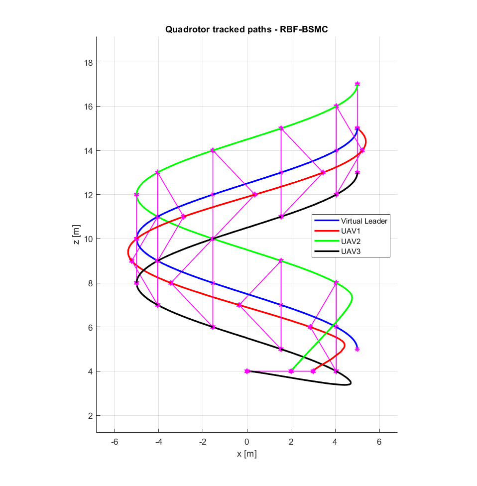

# Radial Basis Function Neural Networks for Formation Control of Unmanned Aerial Vehicles

### Duy Nam Bui and Manh Duong Phung
Vietnam National University, Hanoi, Vietnam <br>
Fulbright University Vietnam, Ho Chi Minh City, Vietnam <br>

```
@ARTICLE{Nam2024,
  author={Bui, Duy Nam and Phung, Manh Duong},
  booktitle={Robotica}, 
  title={Radial Basis Function Neural Networks for Formation Control of Unmanned Aerial Vehicles}, 
  year={Accepted},
  volume={},
  number={},
  pages={},
  doi={}}
```

The proposed RBF-BSMC to deal with External Disturbance for a team of Multiple UAVs flying in Formation

## Results
### Simulation Results: [video](https://youtu.be/LYD7269n1-c?si=tZ8d34fPaQAHHizl)
#### Scenario 1

 

#### Scenario 2

 


### Experiment Results: [video](https://youtu.be/1yUCzWRDcp0?si=hyUxxyt6kPb2hgrZ)


## Generate a Standalone ROS Node from Simulink
To develop and deploy controllers on ROS, please follow this [guideline](https://www.mathworks.com/help/ros/ug/generate-a-standalone-ros-node-from-simulink.html)
